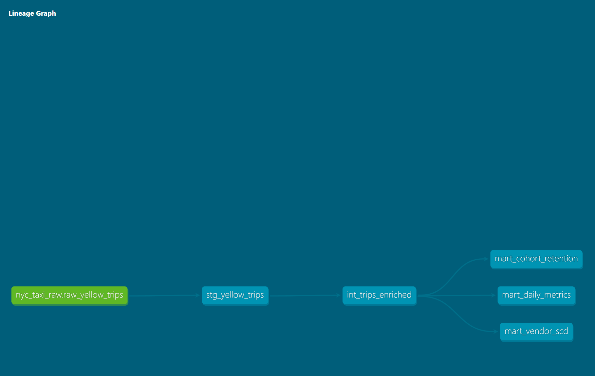

# NYC TLC Taxi Analytics — dbt + Databricks

An end-to-end data engineering project that transforms 7M+ raw NYC taxi 
trips into business-ready analytics using the Medallion architecture on 
Databricks with dbt Core.

---

## Business Questions Answered

- Which hours and days generate the most revenue per vendor?
- How does trip distance and duration vary across time of day?
- What is the month-over-month rider retention rate by cohort?
- How has vendor performance (revenue, avg fare) changed over time?
- What share of trips are paid by cash vs credit card?

---

## Tech Stack

| Tool | Purpose |
|------|---------|
| Databricks | Cloud lakehouse compute and storage |
| Delta Lake | ACID-compliant table format on DBFS |
| PySpark | Raw data ingestion and Delta table creation |
| dbt Core | SQL transformation, testing, and documentation |
| Unity Catalog | Three-level namespace governance |
| GitHub | Version control |

---

## Architecture

